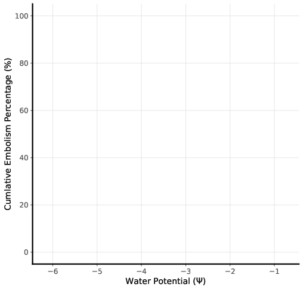

Plant Network Segmentation
==========================
Welcome to the home of the Plant Network Segmentation code base. This code
base can be used to interact with raw leaf images intended to be used as
input to the Optical Vulnerability (OV) method. The code base is broken into
two components: a plant handler and TF2 model builder.

The plant handler contains actions to interact with OV method data. In
addition it contains an object orientated data model to make further
analysis easier.

The TF2 model builder can be used to train a Tensorflow model. Three models
are available for training. The trained model can be saved and then used to
make predictions in the first component. However, the first component has
been structured such that the prediction is independent of Tensorflow
specifically. Any model which inherits the abstract Model class, and
consequently implements a predict_tile method can be used. The how to use
section explains how to interact with each component.

.. image:: resources/images/leaf.gif
   :width: 50%

.. toctree::
   :maxdepth: 2
   :caption: How to Use

   pages/how_to_use_overview
   pages/how_to_use_main_interactive
   pages/how_to_use_main_cl
   pages/how_to_use_tf2
   pages/data_model_xml

.. toctree::
   :maxdepth: 2
   :caption: Actions

   pages/dataset
   pages/eda
   pages/extraction
   pages/plotting
   pages/prediction

.. toctree::
   :maxdepth: 2
   :caption: PNS Helpers
   
   pages/describe_leaf
   pages/extract_dataset
   pages/utilities

.. toctree::
   :maxdepth: 2
   :caption: PNS Models

   pages/data_model
   pages/model

.. toctree::
   :maxdepth: 2
   :caption: TF Models

   pages/tensorflow/u-net
   pages/tensorflow/u-net_resnet
   pages/tensorflow/w-net

.. toctree::
   :maxdepth: 2
   :caption: TF HyperModels

   pages/tensorflow/hyper_u-net
   pages/tensorflow/hyper_u-net_resnet
   pages/tensorflow/hyper_w-net

.. toctree::
   :maxdepth: 2
   :caption: Losses

   pages/tensorflow/custom_losses

.. toctree::
   :maxdepth: 2
   :caption: Callbacks

   pages/tensorflow/lrt
   pages/tensorflow/ocp

.. toctree::
   :maxdepth: 2
   :caption: Helpers

   pages/tensorflow/utilities
   pages/tensorflow/train_test

Indices and tables
------------------

* :ref:`genindex`
* :ref:`modindex`
* :ref:`search`

.. image:: resources/images/leaf_love.gif
   :align: center
   :scale: 90%
