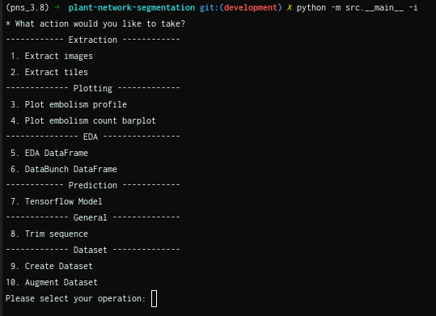

.. _how_to_interact:

Package in Interactive Mode
===========================
In interactive mode the user will have the option to interactively specify both
which operation should be performed and what parameters should be used. To
run the module in interactive mode the following command should be specified
from the root of `plant-network-segmentation` folder:

.. prompt:: bash $

   python -m src.__main__ -i

The above command runs the package __main__ as a module in interactive mode.
Invoking the command will present the following screen, which displays an
interactive menu:

The possible actions that can be taken are easily viewed by looking at the
interactive menu. Once an action is selected, further input prompts will be
presented, which will capture the arguments with which to run the action.
Once all parameters have been provided by the user, there will be an option
to re-enter any arguments which need to change. If the user is happy with
their inputs they will be given the option to save this configuration in a
json file.

While the interactive mode makes proving arguments to the program easier, it
can be laborious to do many times - especially if same configuration is to
be used. To address this concern, the package can also be run using a json
file saved while using interactive mode. By doing this the package will be
run with the exact same configuration as was used in the session that the
json file was saved; of course there is also the option to edit this json.
To run the package using an interactive mode json the following command
should be used:

.. prompt:: bash $

   python -m src.__main__ -j <interactive_mode.json>

.. note::
    The -j flag should not be confused with -fj flag, which is used to
    provide a json when using command line mode.

The interactive mode templates, and some notes regarding each action is
shared below. However, it is worth noting that these files will be created
automatically when saving at the end of interactive mode.

Extraction
----------
Images
^^^^^^
JSON template
"""""""""""""
.. code-block:: json

   {
     "which": "extract_images",
     "leaves": {
       "input": {
         "folder_path": [
           "test1/test2/",
           "test3/"
         ],
         "filename_pattern": [
           "*.png",
           "*.tif"
         ]
       }
     },
     "masks": {
       "input": {
         "mpf_path": [
           "test1/test2/multipage1.tif",
           "test3/multipage2.tif"
         ]
       }
     },
     "leaf_output_path": "test1/test2/extracted/leaves/test2_leaf.png;test3/extracted/leaves/test3_leaf.png",
     "mask_output_path": "test1/test2/extracted/masks/test2_mask.png;test3/extracted/masks/test3_mask.png",
     "overwrite": true,
     "binarise": false
   }

Tiles
^^^^^
If the default name should be used to save the image tiles, please enter
"default" when prompted. Using the default name will create a folder called
"<image>-chips" - where <images> will either be leaves or masks - in the
parent folder of where your images are located. The image tiles will have
the same name as their parent image with it's number added at the end. For
example if a parent image is called leaf_1, and there are 10 tiles per
image, the tiles will be named as image_1_<i>.png, where i will indicate the
tile number; this will be repeated for each tile.

.. warning::
    Using custom file names to save the tile is not currently working.
    Rather use "default"

JSON template
"""""""""""""
.. code-block:: json

   {
     "which": "extract_tiles",
     "leaves": {
     "input": {
       "folder_path": [
         "test1/test2/extracted/leaves/",
         "test3/leaves/extracted/"
       ],
       "filename_pattern": [
         "*.png",
         "*.png"
       ]
     }
     },
     "masks": {
     "input": {
       "folder_path": [
         "test1/test2/extracted/masks/",
         "test3/extracted/masks/"
       ],
       "filename_pattern": [
         "*.png",
         "*.png"
       ]
     }
     },
     "leaf_output_path": "test1/test2/extracted/leaf-chips/*.png;test3/extracted/leaf-chips/*.png",
     "mask_output_path": "test1/test2/extracted/leaf-chips/*.png;test3/extracted/leaf-chips/*.png",
     "overwrite": true,
     "stride_x": 256,
     "stride_y": 256,
     "length_x": 256,
     "length_y": 256
   }

Plotting
--------
Embolism profile
^^^^^^^^^^^^^^^^
JSON template
"""""""""""""
.. code-block:: json

   {
     "which": "plot_profile",
     "leaves": {
      "input": {
       "folder_path": [
         "test1/test2/extracted/leaves/",
         "test3/leaves/extracted/"
       ],
       "filename_pattern": [
         "*.png",
         "*.png"
       ]
     }
     },
     "masks": {
     "input": {
       "folder_path": [
         "test1/test2/extracted/masks/",
         "test3/extracted/masks/"
       ],
       "filename_pattern": [
         "*.png",
         "*.png"
       ]
     }
     },
     "output_path": "test2.svg;test3.svg",
     "leaf_names": "Leaf 1;Leaf 2",
     "show": false
   }

Embolism count
^^^^^^^^^^^^^^
JSON template
"""""""""""""
.. code-block:: json

   {
     "which": "plot_embolism_counts",
     "leaves": {
     "input": {
       "folder_path": [
         "test1/test2/extracted/leaves/",
         "test3/leaves/extracted/"
       ],
       "filename_pattern": [
         "*.png",
         "*.png"
       ]
     }
     },
     "masks": {
     "input": {
       "folder_path": [
         "test1/test2/extracted/masks/",
         "test3/extracted/masks/"
       ],
       "filename_pattern": [
         "*.png",
         "*.png"
       ]
     }
     },
     "output_path": "test2.svg;test3.svg",
     "leaf_names": "Leaf 1;Leaf 2",
     "show": false,
     "leaf_embolism_only": false,
     "tile": true,
     "percent": true
   }

EDA
---
EDA DF
^^^^^^

JSON template
"""""""""""""
.. code-block:: json

   {
      "which": "eda_df",
      "leaves": {
        "input": {
          "folder_path": [
            "test1/test2/extracted/leaves/",
            "test3/leaves/extracted/"
          ],
          "filename_pattern": [
            "*.png",
            "*.png"
          ]
        }
      },
      "masks": {
        "input": {
          "folder_path": [
            "test1/test2/extracted/masks/",
            "test3/extracted/masks/"
          ],
          "filename_pattern": [
            "*.png",
            "*.png"
          ]
        }
      },
      "csv_output_path": "test2.csv;test3_eda.csv",
      "tiles": false,
      "eda_df_options": {
        "linked_filename": false,
        "unique_range": true,
        "embolism_percent": true,
        "intersection": true,
        "has_embolism": false
      }
   }

DataBunch DF
^^^^^^^^^^^^
JSON template
"""""""""""""
.. code-block:: json

   {
      "which": "databunch_df",
      "leaves": {
        "input": {
          "folder_path": [
            "test1/test2/extracted/leaves/",
            "test3/leaves/extracted/"
          ],
          "filename_pattern": [
            "*.png",
            "*.png"
          ]
        }
      },
      "masks": {
        "input": {
          "folder_path": [
            "test1/test2/extracted/masks/",
            "test3/extracted/masks/"
          ],
          "filename_pattern": [
            "*.png",
            "*.png"
          ]
        }
      },
      "csv_output_path": "test2.csv;test3_eda.csv",
      "tiles": false,
      "leaf_embolism_only": true,
      "tile_embolism_only": true
   }

General
-------
Trim
^^^^
JSON template
"""""""""""""
.. code-block:: json

   {
      "which": "trim_sequence",
      "leaves": {
        "input": {
          "folder_path": [
            "test1/test2/extracted/leaves/",
            "test3/leaves/extracted/"
          ],
          "filename_pattern": [
            "*.png",
            "*.png"
          ]
        }
      },
      "masks": {
        "input": {
          "folder_path": [
            "test1/test2/extracted/masks/",
            "test3/extracted/masks/"
          ],
          "filename_pattern": [
            "*.png",
            "*.png"
          ]
        }
      },
      "y_size_dir": "(1000, -1);None",
      "x_size_dir": "(1280, 1);(960,-1)",
      "overwrite": true,
      "mask": false
   }

