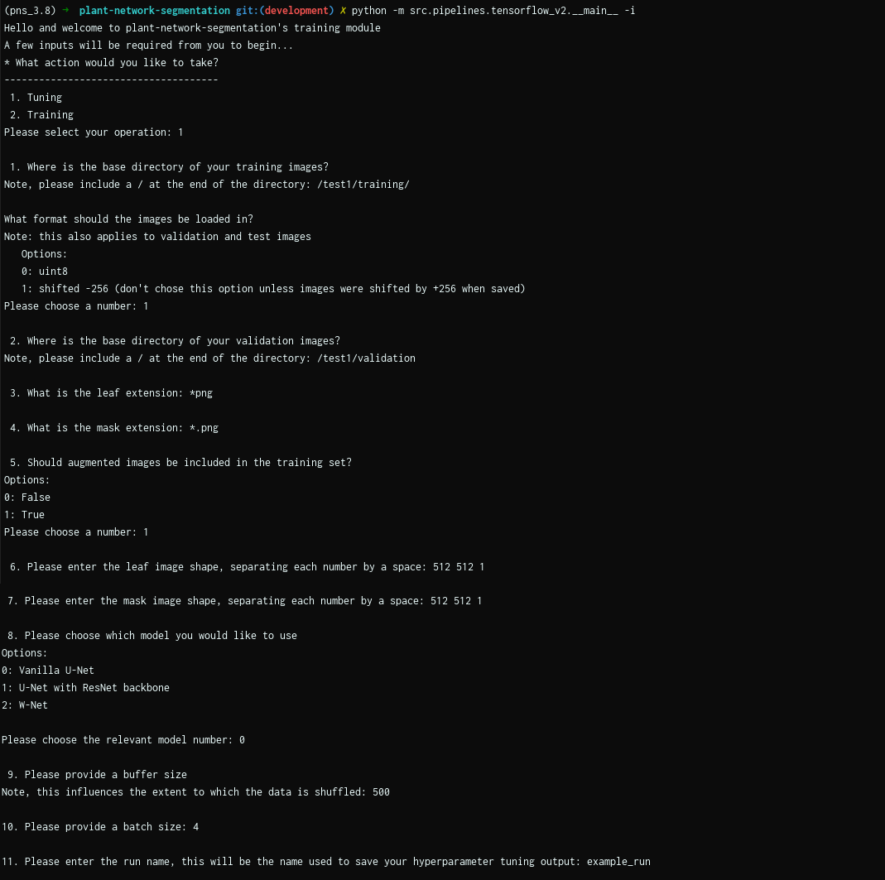
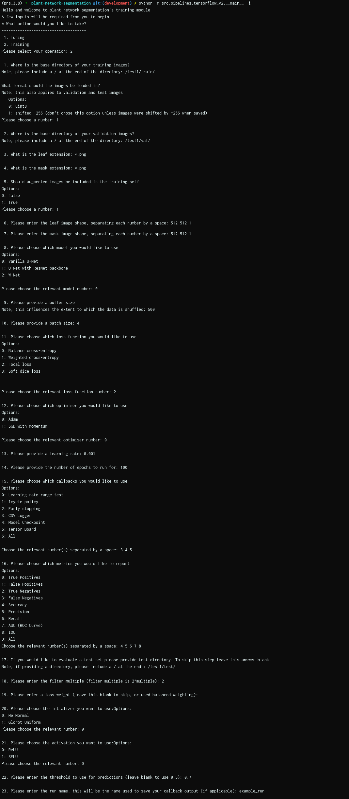

.. _how_to_tf2:

TF2 Model Builder
=================
There are two main actions that can be take using the TF2 Model Builder code
base. The first is (hyperparameter) tuning and the second is training.
There are 3 models available for both training and tuning, namely U-Net, U-Net
(ResNet34), and W-Net.

.. prompt:: bash $

   python -m src.pipelines.tensorflow_v2.__main__ -i

Running this command will produce an option to either using the tuning or
training action.  Each action has it's own input prompt. Once an the input
prompt is complete, there will be an option to save the results as a json.
The code base can be run using this json in the future, where the json file
will contain the run parameters. The input prompt and json templates for
each action are provided in the subsequent sections.

Tuning
------
Input Prompt
^^^^^^^^^^^^

JSON template
^^^^^^^^^^^^^
If a json has been saved after going through the input prompt, it can be
used by running this command:

.. prompt:: bash $

   python -m src.__main__ -j <input_prompt.json>

.. code-block:: json

   {
     "which": "tuning",
     "train_base_dir": "/test1/training/",
     "transform_uint8": false,
     "shift_256": true,
     "val_base_dir": "/test1/validation",
     "leaf_ext": "*png",
     "mask_ext": "*.png",
     "incl_aug": true,
     "leaf_shape": [
       512,
       512,
       1
     ],
     "mask_shape": [
       512,
       512,
       1
     ],
     "model_choice": 0,
     "buffer_size": 500,
     "batch_size": 4,
     "run_name": "example_run"
   }

Training
--------
Input Prompt
^^^^^^^^^^^^

JSON template
^^^^^^^^^^^^^
.. code-block:: json

   {
     "which": "training",
     "train_base_dir": "/test1/train/",
     "transform_uint8": false,
     "shift_256": true,
     "val_base_dir": "/test1/val/",
     "leaf_ext": "*.png",
     "mask_ext": "*.png",
     "incl_aug": true,
     "leaf_shape": [
       512,
       512,
       1
     ],
     "mask_shape": [
       512,
       512,
       1
     ],
     "model_choice": 0,
     "buffer_size": 500,
     "batch_size": 4,
     "loss_choice": 2,
     "opt_choice": 0,
     "lr": 0.001,
     "epochs": 100,
     "callback_choices": [
       3,
       4,
       5
     ],
     "metric_choices": [
       4,
       5,
       6,
       7,
       8
     ],
     "test_dir": "/test1/test/",
     "filters": 2,
     "loss_weight": null,
     "initializer": "glorot_uniform",
     "activation": "selu",
     "threshold": 0.7,
     "run_name": "example_run"
   }
